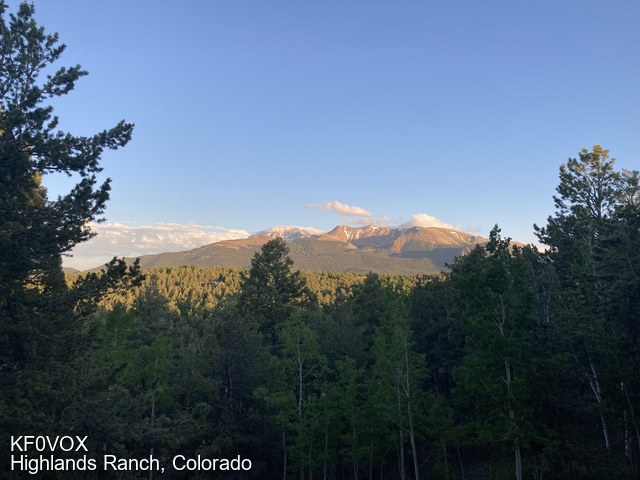
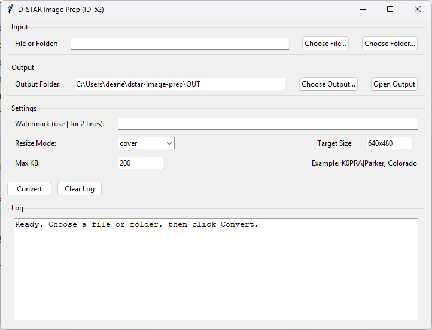

## D-STAR Image Prep


A small Python utility for preparing \*\*ID-52 compatible D-STAR image files\*\*.


## Features

\- Resizes images to 640×480

\- Forces baseline (non-progressive) JPEG

\- Automatically keeps files under 200 KB

\- Optional callsign watermark

\- Batch or single image support


## Example Output

\- Below is an example image generated by the tool and successfully loaded on an Icom ID-52:




## Graphical User Interface (GUI)

This project includes a simple graphical user interface (GUI) for operators who prefer not to use the command line.

The GUI is designed for non-technical users and field operations while still producing fully
D-STAR–compatible images for radios such as the Icom ID-52.



### Features

The GUI allows you to:

- Select a single image or an entire folder
- Choose an output folder
- Add a callsign and location watermark
- Add an optional caption line (landmark, elevation, event name, etc.)
- Select resize mode (cover / contain / exact)
- Convert images with a single click

### Running the GUI

From the project folder, activate the virtual environment and run:

```bash

python dstar_gui.py

```


## Requirements

\- Python 3.10+

\- Pillow


## Setup

```bash

python -m venv .venv

```
```bash

.\\.venv\\Scripts\\Activate.ps1

```
```bash

python -m pip install pillow

```


